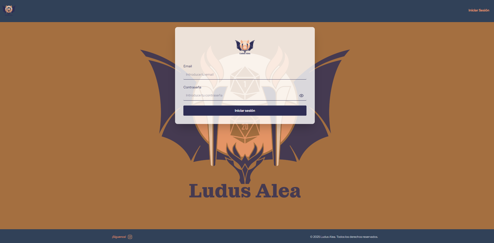
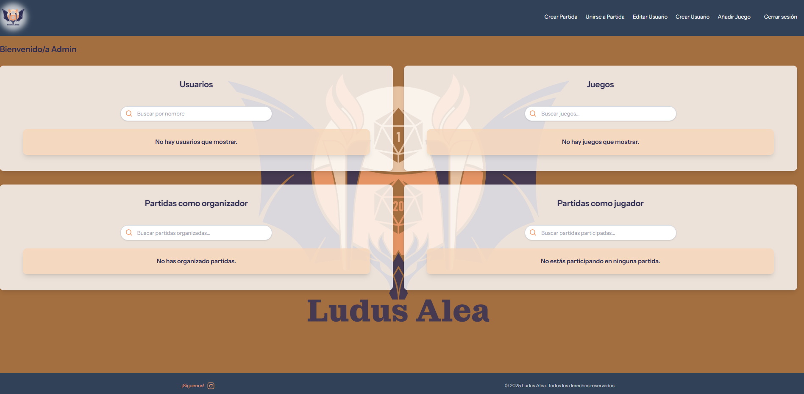
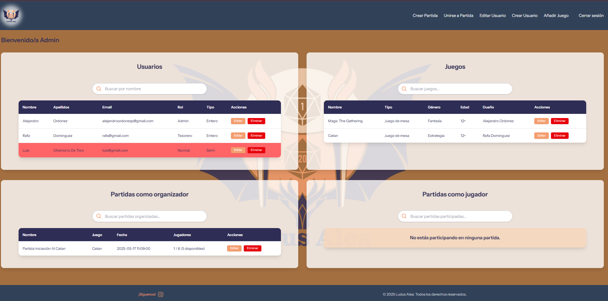
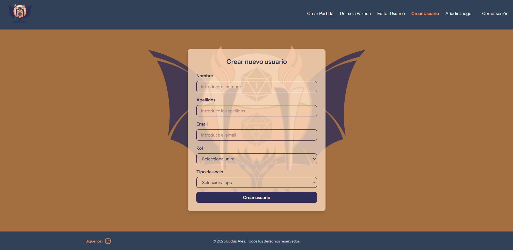
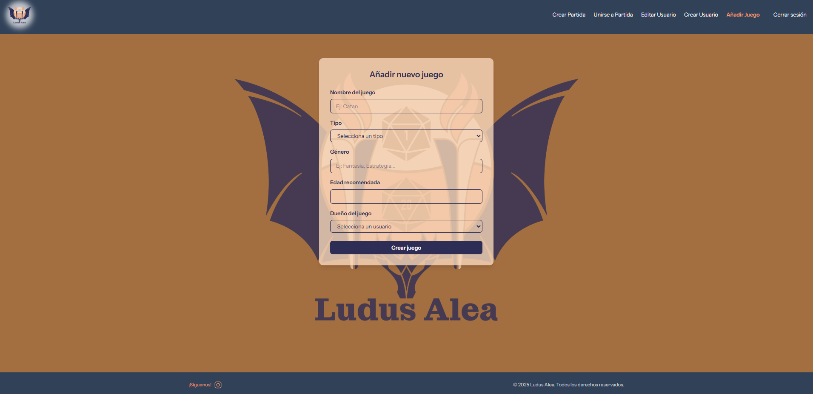
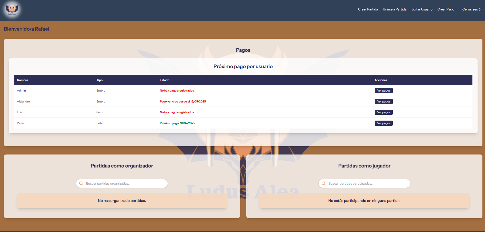
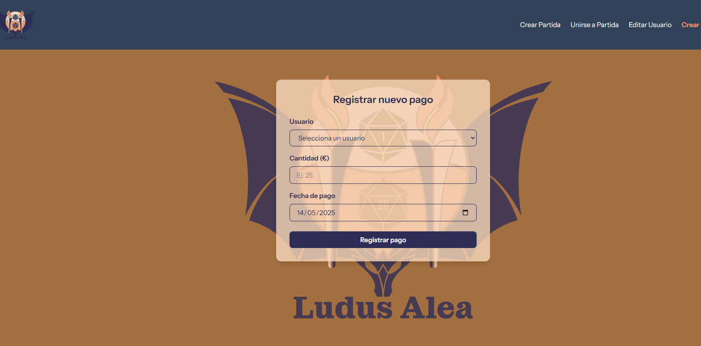
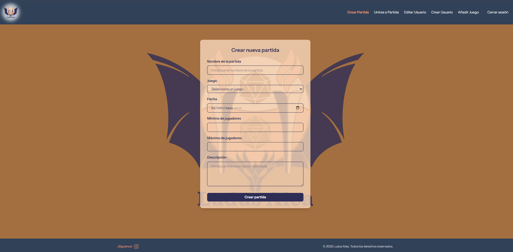
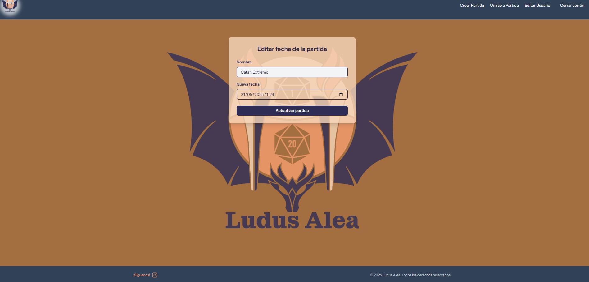
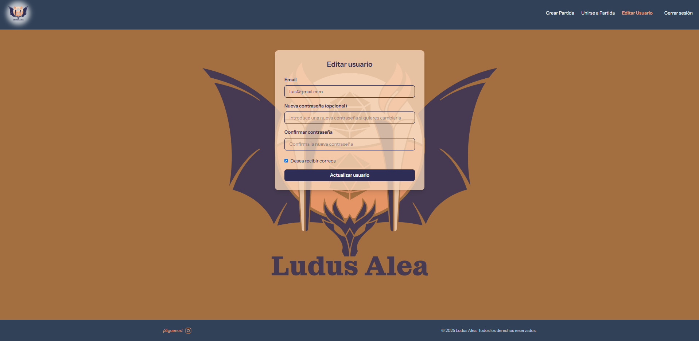

  

<h1 align="center" style="color:#2e2d55">Proyecto Integrado: Aplicación Ludus Alea</h1>

  <strong style="color:#f49d6e">Asociación cultural de juegos de mesa, rol y ocio alternativo.</strong>

---

## 🎯 Descripción

**Ludus Alea** es una asociación real que necesitaba una aplicación para gestionar: usuarios, partidas, pagos y juegos.

Incluye autenticación con control de acceso por roles (`admin`, `tesorero`, `normal`), sistema de baja de usuarios, notificaciones por correo y un panel adaptado según permisos.

---

## ⚙️ Tecnologías utilizadas

- ✅ Laravel 10
- ✅ Tailwind CSS
- ✅ PHP 8.2+
- ✅ Composer
- ✅ Laravel Herd 
- ✅ Visual Studio Code

---

## 🚀 Instalación y uso

1. **Clonar el repositorio y acceder a él**

git clone https://github.com/tu_usuario/ludus-alea.git
cd ludus-alea

2. **Crear un proyecto existente en Herd**
 
 Iremos a Sites, link Existing Project y eligiremos la ruta del repositorio

3. **Instalar dependencias de PHP**

    composer install

4. **Instalar dependencias de JS**

        npm install

5. **Configurar el archivo .env**
        
        cp .env.example .env 

        APP_NAME="Ludus Alea"
        APP_URL= la url que te dio Laravel Herd cuando accedes a Sites

        DB_CONNECTION=sqlite
       

        MAIL_MAILER=smtp
        MAIL_HOST=smtp.gmail.com
        MAIL_PORT=587
        MAIL_USERNAME=tu_correo@gmail.com
        MAIL_PASSWORD=tu_contraseña_o_token
        MAIL_ENCRYPTION=tls
        MAIL_FROM_ADDRESS=tu_correo@gmail.com
        MAIL_FROM_NAME="Ludus Alea"

6. **Generar clave de la aplicación**

        php artisan key:generate

7. **Crear la BBBDD en database**   

        En la carpeta database crea un archivo database.sqlite

5. **Ejecutar migraciones y semilla por defecto**

        php artisan migrate:fresh --seed 

6. **Arrancar el proyecto**
        npm run dev

  ##  💻 Funcionamiento      

  1. **Inicio de  Sesion**

        
        Introduce los siguientes credenciales:
       
       -  Email: admin@gmail.com
       - Contraseña: 123456 
    
2. **Vista de cuenta  Administrador**
    -  Home Vacio:

    

    - Home Con datos:  
    

    - Crear Usuario:

    

    - Crear Juego:

    

    - Editar usuario siendo Admin:

    

    2. **Vista de cuenta  Tesorero**
    - Home: 

    

    - Crear pago:

    

    3. **Vista como usuario Normal**

    - Home: 

    

    4. **Funcionalidades de todos los usuarios**

    - Crear Partida:

    

    - Editar Partida:
    
    

    - Editar Usuario propio (Sin ser Admin)
    
    

